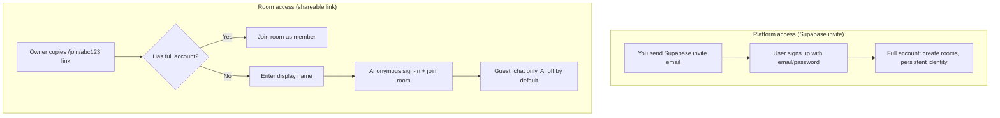
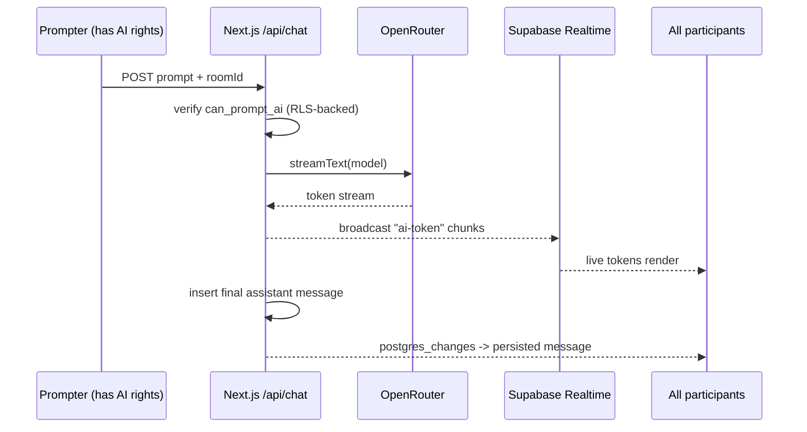
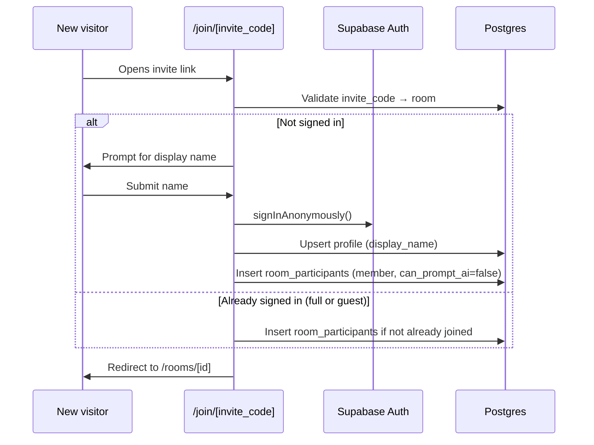

# AI Chat Rooms - MVP Plan

## Overview

Build a Next.js + Supabase app with multi-user chat rooms wrapping AI models via OpenRouter. Room creators share invite links so guests can join with just a name; full accounts are invite-only via Supabase Auth. The owner controls who may prompt the AI; AI responses stream live to everyone in the room.

## Is Next + Supabase enough?

Yes, with one addition. Supabase covers **auth, database, row-level security, and realtime**. Next.js covers the **UI and the server route that talks to AI**. The only extra piece is the **Vercel AI SDK + OpenRouter provider** to wrap the models. No separate backend or websocket server is needed.

## Stack

- **Next.js (App Router, TypeScript)** + Tailwind + shadcn/ui
- **Bun**: package manager and runtime (`bun install`, `bun dev`, `bun run build`)
- **Supabase**: Postgres, Auth, Realtime, RLS (`@supabase/ssr`)
- **AI**: `ai` (Vercel AI SDK v6) + `@openrouter/ai-sdk-provider` (v2.9.x)

## Tooling (Bun)

Use Bun instead of npm/pnpm for all project commands:

```bash
bun create next-app ai-chat-rooms --typescript --tailwind --eslint --app --no-src-dir --import-alias "@/*"
cd ai-chat-rooms
bun add ai @openrouter/ai-sdk-provider @supabase/supabase-js @supabase/ssr
bunx shadcn@latest init
bun dev
```

Commit `bun.lock` (not `package-lock.json`). If shadcn asks for a package manager, choose **bun**.

## Access model: two kinds of invites

There are **two separate invite mechanisms** — do not conflate them.

### 1. Platform access (Supabase Auth invites)

Who can create a **full account** (email/password, persistent identity, create rooms).

- **Public signup is disabled** in Supabase Dashboard → Authentication → Providers.
- Only users you invite via **Supabase Auth invites** (Dashboard or Admin API) can register.
- Prevents random people from discovering and spamming the app.
- Invited users complete signup (set password / confirm email), get a normal `auth.users` row, and a `profiles` row.

### 2. Room access (shareable chat links)

Who can enter a **specific room** to chat with humans (and optionally AI if allowed).

- Room owner gets a **copyable invite link**, e.g. `https://app.example.com/join/{invite_code}`.
- Anyone with the link can join **that room only** — not the whole platform.
- If they have **no account**, they are prompted for a **display name** on the join page, then get a **temporary guest session** via Supabase **anonymous sign-in**.
- Guest gets a real `auth.users` row (`is_anonymous = true`), a `profiles.display_name`, and a `room_participants` row.
- Guests can **send human messages**; `can_prompt_ai` defaults to `false` unless the owner toggles it.
- Guests do **not** get platform access (cannot create rooms or sign up without a Supabase invite).



### Supabase project settings (manual, before launch)

- [ ] **Disable** public sign-ups (Authentication → Providers → Email → disable "Enable sign ups" or use invite-only mode)
- [ ] **Enable** anonymous sign-ins (Authentication → Providers → Anonymous)
- [ ] Send platform invites only to people who should create full accounts
- [ ] **URL Configuration:** Site URL `http://localhost:3000`, Redirect URLs include `http://localhost:3000/auth/callback` and `http://localhost:3000/auth/confirm`
- [ ] **Invite email template** (Authentication → Email Templates → Invite user): replace `{{ .ConfirmationURL }}` with:
  ```html
  <a href="{{ .SiteURL }}/auth/confirm?token_hash={{ .TokenHash }}&type=invite">Accept invite and set password</a>
  ```

## Permission behavior

- Creator joins as `owner` with `can_prompt_ai = true`.
- Users joining via room link join as `member` with `can_prompt_ai = false`.
- **Guests and members alike** can send human messages; only participants with `can_prompt_ai = true` can trigger the AI.
- Owner toggles a participant's `can_prompt_ai` in the participant panel; `/api/chat` rejects AI prompts from users without it.
- Composer shows AI input only when `can_prompt_ai = true`; human chat is always available to room participants.

## Data model (Postgres + RLS)

- `profiles` (id -> auth.users, display_name, avatar_url) — display_name required for guests at join time
- `rooms` (id, name, created_by, model, invite_code, created_at) — `invite_code` powers shareable `/join/{invite_code}` links
- `room_participants` (room_id, user_id, role 'owner'|'member', **can_prompt_ai** bool default false, joined_at) - PK (room_id, user_id)
- `messages` (id, room_id, user_id nullable, role 'user'|'assistant'|'system', content, model, **reply_to_id** nullable, created_at)

Guest vs full user is determined by `auth.users.is_anonymous` (Supabase built-in), not a custom column.

RLS rules:

- Read rooms/messages/participants only if you are a participant of that room.
- Insert `messages` as a human only for rooms you belong to.
- Update `room_participants.can_prompt_ai` only if you are the room `owner`.
- Assistant messages inserted server-side via the route handler.
- **Only non-anonymous (full) users** can insert into `rooms` (create rooms) — enforced in RLS or server action.

## Core idea: how shared AI streaming works

A single Next.js Route Handler is the only place the AI is called. It checks permission, calls the model, streams tokens, and rebroadcasts those tokens to the room's Supabase Realtime channel so every participant sees them live. The final message is written once to the `messages` table.



## Join flow (room invite link)



## Key files

- `lib/supabase/{client,server,admin,proxy}.ts` - browser, server, admin, and session refresh clients
- `proxy.ts` - Next.js 16 session refresh on each request
- `app/(auth)/login` - login for invited full accounts (no public signup)
- `app/join/[invite_code]/page.tsx` - room invite link; name prompt + anonymous join for guests
- `app/rooms/page.tsx` - list/create rooms (full accounts only)
- `app/rooms/[id]/page.tsx` - room view (message list, composer, participant panel, copy invite link)
- `components/room/{MessageList,Composer,ParticipantList}.tsx`
- `app/api/chat/route.ts` - permission check + `streamText` + broadcast + persist
- `supabase/migrations/*.sql` - schema + RLS

## Realtime wiring

Each room view subscribes to one Supabase channel per `roomId`:

- `postgres_changes` on `messages` -> committed human + final AI messages (optional fallback)
- `broadcast` event `message` -> human messages and persisted assistant messages
- `broadcast` event `ai-token` -> live streaming AI text (rendered as a pending assistant bubble until the persisted row arrives)

## Environment variables

```env
NEXT_PUBLIC_SUPABASE_URL=
NEXT_PUBLIC_SUPABASE_ANON_KEY=
SUPABASE_SERVICE_ROLE_KEY=
OPENROUTER_API_KEY=
```

## Implementation steps

| Step | ID | Status | Description |
|------|-----|--------|-------------|
| 1 | scaffold | done | Next.js + Tailwind + shadcn + Bun + deps + `.env.local` |
| 2 | supabase-setup | done | Browser + server Supabase clients, proxy, env validation |
| 3 | schema-rls | done | Migrations + RLS; `join_room` / `create_room` RPCs; realtime on messages |
| 4 | auth | done | Login, auth callback, guest sign-in helper, route protection |
| 5 | rooms | done | List/create rooms, copy invite link, `/join/[code]` guest flow |
| 6 | permissions | done | Owner toggles `can_prompt_ai`; composer hides AI without permission |
| 7 | chat-realtime | done | Message list + composer + Realtime on messages |
| 8 | ai-route | done | `/api/chat`: permission check, stream, broadcast, persist |
| 9 | polish | pending | Pending AI bubble, model label, empty/error states |

## Out of scope for MVP

Per-room model picker UI, history search, usage limits/billing, typing indicators, message edits, converting guest sessions to full accounts, guest session expiry/TTL cleanup.
